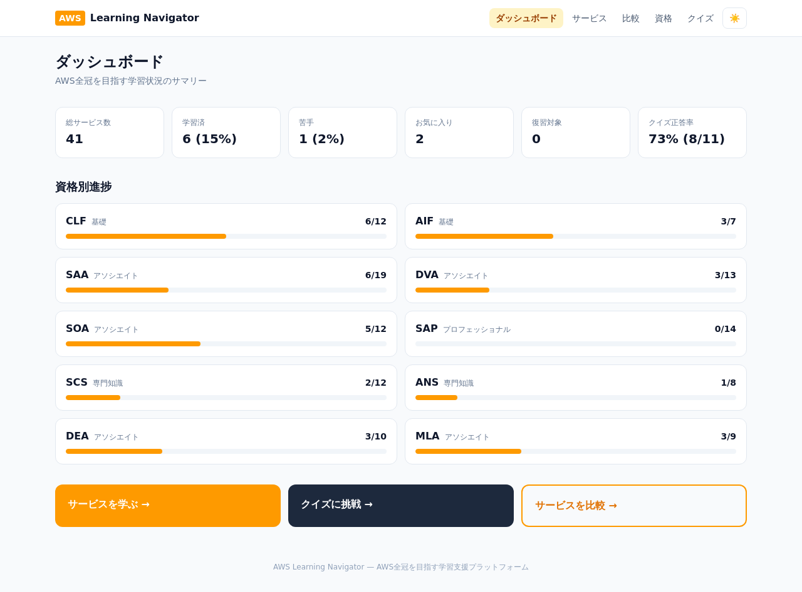
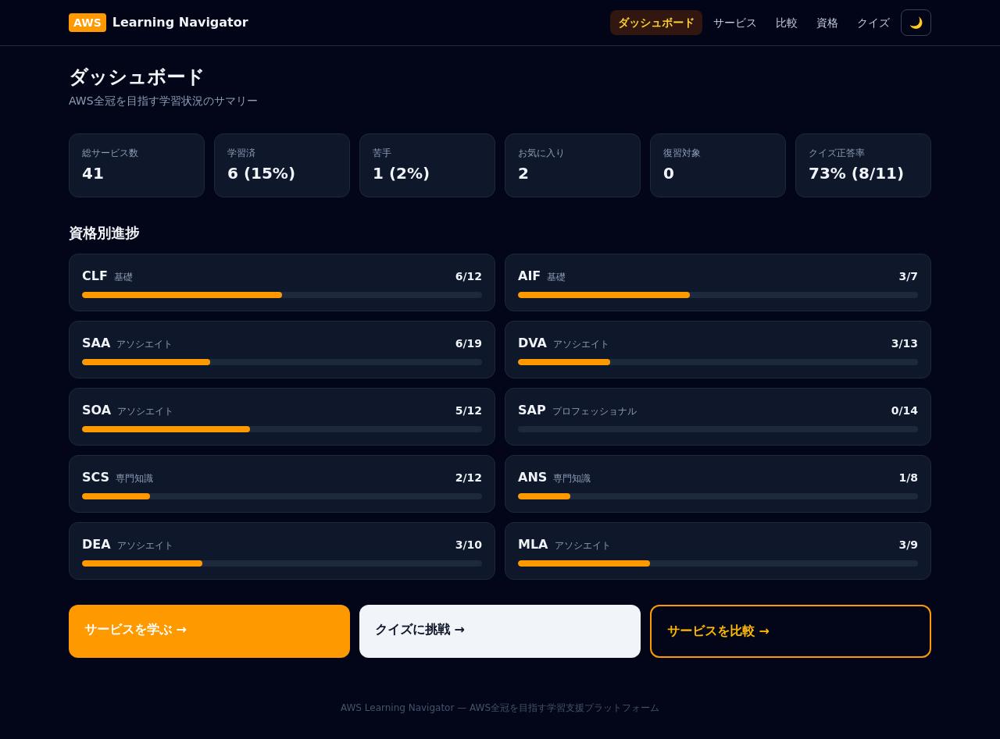
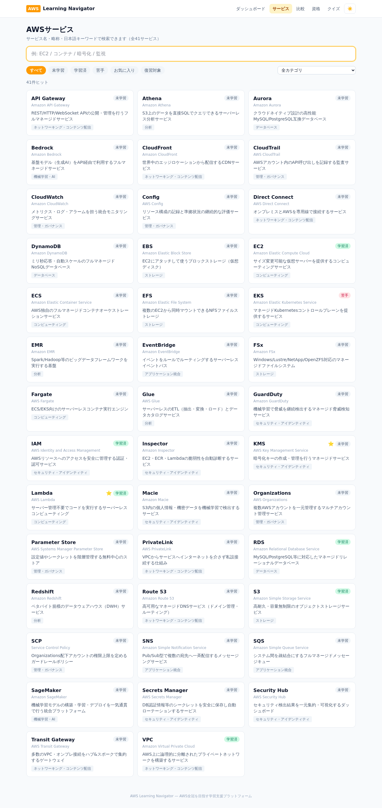
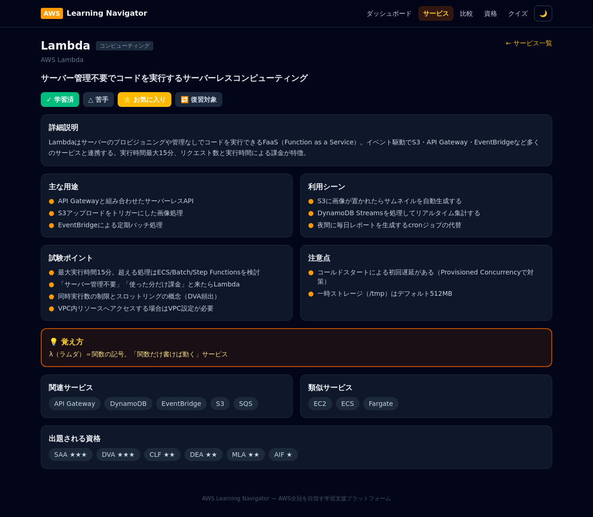
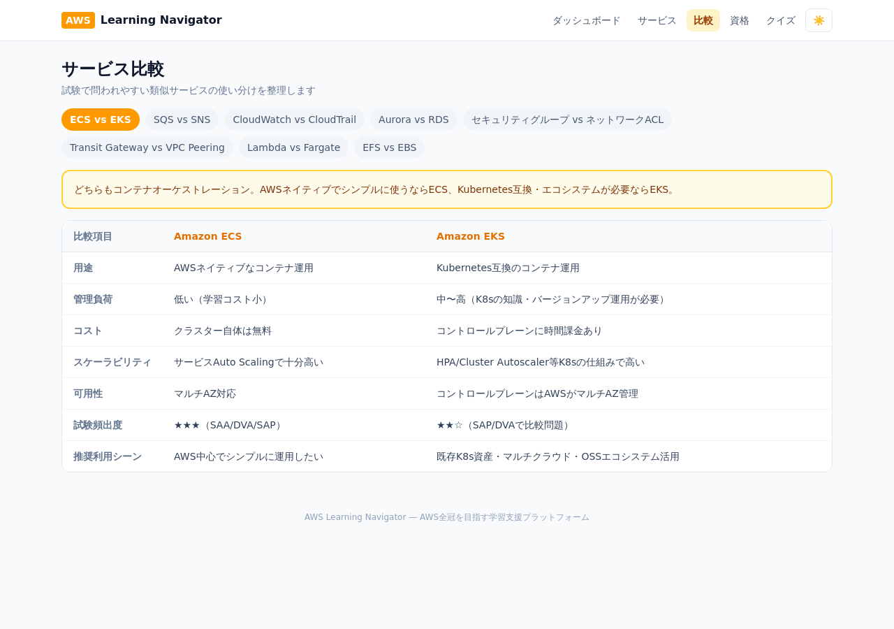
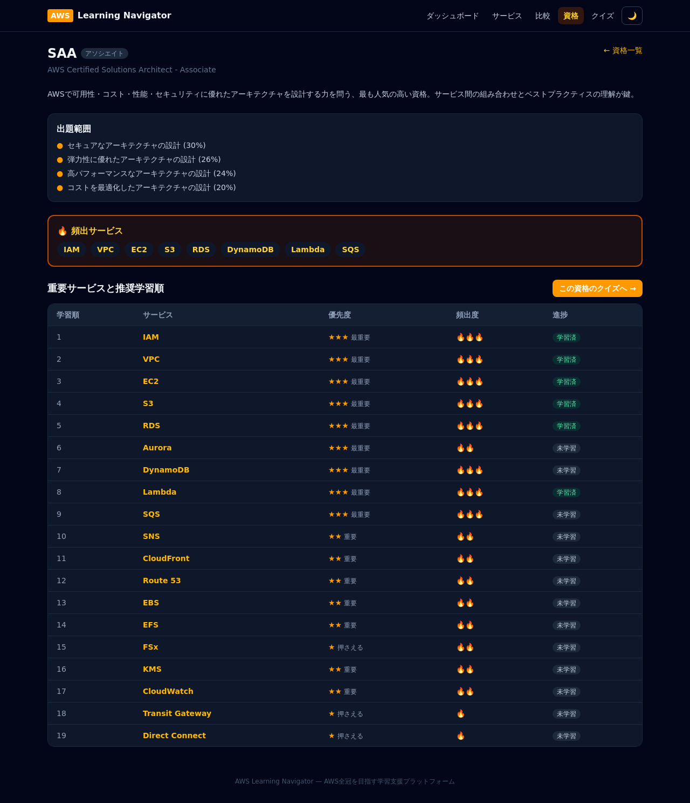
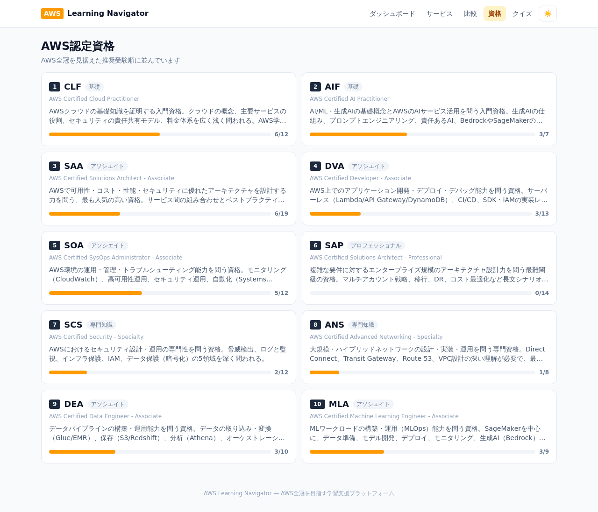
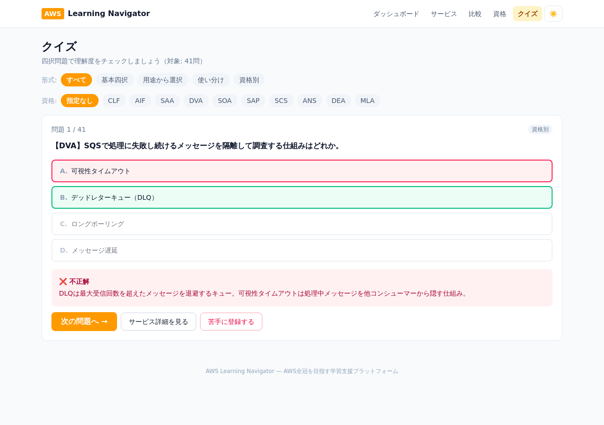

# AWS Learning Navigator

AWS認定資格取得者向けに、AWSサービス・用語・アーキテクチャを効率的に学習できる学習支援プラットフォームです。AWS全冠レベルの知識獲得を支援します。

## 主な機能（MVP）

| 機能 | 説明 |
|---|---|
| サービス検索 (F001) | サービス名・略称・日本語キーワードで41サービスを高速検索 |
| サービス詳細 (F002) | 説明・用途・利用シーン・試験ポイント・注意点・覚え方・関連/類似サービス |
| サービス比較 (F003) | ECS vs EKS / SQS vs SNS / SG vs NACL など8組の比較表 |
| 資格別学習 (F004) | CLF〜MLAの10資格。出題範囲・重要/頻出サービス・推奨学習順 |
| 学習進捗管理 (F005) | 学習済 / 苦手 / お気に入り / 復習対象、学習率・苦手率 |
| クイズ (F006) | 基本四択・用途選択・使い分け・資格別の4形式、計41問 |
| ダッシュボード (F007) | 総サービス数・学習済数・苦手数・正答率・資格別進捗 |

## 画面プレビュー

| ダッシュボード（ライト） | ダッシュボード（ダーク） |
|---|---|
|  |  |

| サービス検索 | サービス詳細（ダーク） |
|---|---|
|  |  |

| サービス比較 | 資格別学習（ダーク） |
|---|---|
|  |  |

| 資格一覧 | クイズ |
|---|---|
|  |  |

## 技術スタック

- **TypeScript** / **Next.js 15** (App Router) / **React 19**
- **Tailwind CSS v4**（レスポンシブ・ダークモード対応）
- **Prisma** + **SQLite**（MVP。スキーマはPostgreSQLへ移行可能な設計）

## セットアップ

```bash
# 1. 依存関係のインストール
npm install

# 2. 環境変数ファイルを用意（DATABASE_URL を定義）
cp .env.example .env

# 3. データベース作成 & シードデータ投入
npm run setup

# 4. 開発サーバー起動
npm run dev
```

http://localhost:3000 を開いてください。

## Docker で本番起動

本番デプロイ用の Docker 構成（マルチステージ / `node:20-alpine` / Next.js standalone）を同梱しています。

```bash
# ビルドして起動（ホスト 80 番 -> コンテナ 3000 番）
docker compose up --build -d
```

http://localhost を開いてください。

- **永続化**: SQLite DB は名前付きボリューム `aws-nav-data`（コンテナ内 `/data/prod.db`）に保存され、再起動・再ビルド後も学習進捗・解答履歴を保持します。
- **初回起動**: ビルド時に焼き込んだシード済み DB を初回のみ展開します（既存 DB は上書きしません）。
- **自動再起動**: `restart: always` により異常停止時も自動復帰します。
- **軽量化**: 本番イメージには devDependencies を含めません（standalone が追跡した実行時依存のみ）。

停止・削除は次の通りです。

```bash
docker compose down            # 停止（DB は保持）
docker compose down -v         # 停止 + DB ボリュームも削除（初期化）
```

### その他のコマンド

```bash
npm run build      # 本番ビルド
npm run start      # 本番サーバー起動
npm run lint       # ESLint（コードの静的解析）
npm run typecheck  # TypeScript型チェック（tsc --noEmit）
npm test           # ユニットテスト（Vitest）
npm run db:push    # スキーマをDBへ反映
npm run db:seed    # シードデータ再投入（進捗・解答履歴は保持）
```

開発手順・品質チェック・ブランチ運用の詳細は [docs/DEVELOPMENT.md](docs/DEVELOPMENT.md) を参照してください。

## ディレクトリ構成

```
prisma/
  schema.prisma        # DBスキーマ（Service / Certification / Quiz / 進捗）
  seed.ts              # シードスクリプト
  data/                # サービス・資格・クイズの学習コンテンツ
src/
  app/                 # 画面（App Router）とAPIルート
  components/          # UIコンポーネント
  data/comparisons.ts  # サービス比較データ
  lib/                 # Prismaクライアント・共通ヘルパー
```

## データの追加方法

- **サービス追加**: `prisma/data/services-a.ts` / `services-b.ts` に追記して `npm run db:seed`
- **資格追加**: `prisma/data/certifications.ts` に追記して `npm run db:seed`
- **クイズ追加**: `prisma/data/quizzes.ts` に追記して `npm run db:seed`
- **比較追加**: `src/data/comparisons.ts` に追記（再シード不要）

## 将来構想

- Phase 2: AWS全冠ロードマップ生成 / AI学習アシスタント / RAG検索 / Bedrock連携
- Phase 3: 学習コミュニティ / ランキング / 模擬試験生成 / 合格予測
