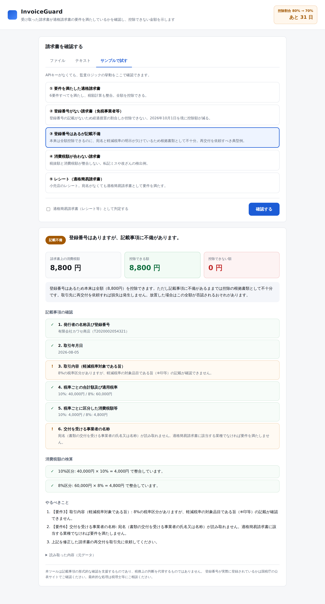

# InvoiceGuard（インボイスガード）

受け取った請求書が適格請求書の要件を満たしていないと、その消費税は仕入税額控除できず、そのまま自社の損失になる。しかし経理担当者は今も1枚ずつ目視で確認している。

```bash
cd apps/invoice-guard && npm install && npm start   # → http://localhost:3000
```



> **2026年10月1日、控除割合が 80% → 70% に下がります。** 令和8年度税制改正により経過措置が5段階に細分化されました。同じ取引先・同じ金額でも、取引日が1日ずれるだけで控除できる額が変わります。

---

## 何をするツールか

請求書（画像・PDF・テキスト）を投げると、次の3つを返します。

1. **適格請求書の要件を満たしているか** — 国税庁が定める記載事項6項目を1つずつ判定
2. **いくら控除できて、いくら損するか** — 取引日に応じた経過措置の割合で金額を算出
3. **何をすればいいか** — 再交付を依頼すべき項目を具体的な文言で提示

判定は次の3区分です。

| 区分 | 意味 | 控除できる額 |
|---|---|---|
| 適格請求書 | 6要件を満たし税額計算も整合 | 全額 |
| 記載不備 | 登録番号はあるが記載に欠落がある | 本来は全額。**放置すると否認されうる** |
| 登録番号なし | 免税事業者等からの仕入れ | 経過措置の割合のみ |

実務で一番お金が漏れるのは真ん中の「記載不備」です。本来100%控除できるはずのものが、宛名や軽減税率の明示が欠けているだけで根拠書類として不十分になる。取引先に一言頼めば解決するのに、気づかれないまま処理されています。

## 設計上の要点：AIと法令判断を分離している

```
請求書の画像/PDF/テキスト
        │
        ▼
  ┌───────────────┐   Claude Opus 5（構造化出力）
  │  抽出レイヤー   │   「紙面に何と書いてあったか」だけを読む
  └───────────────┘   判定は一切させない
        │  ExtractedInvoice（型付きの素データ）
        ▼
  ┌───────────────┐   純粋な TypeScript、依存なし
  │  監査エンジン   │   6要件・チェックディジット・税額検算・経過措置
  └───────────────┘   同じ入力からは常に同じ結果
        │
        ▼
   判定 + 金額 + やるべきこと
```

**税額と法令判断をモデルの出力に委ねていません。** 監査エンジンは決定論的で、なぜその結論になったかを行単位で説明できます。税務は「AIがそう言った」では通らない領域なので、ここを分離できるかがプロダクトとして成立する条件でした。

この分離には実利もあります。監査エンジンはAPIキーなしで単体テストでき、実際に43件のテストが通っています。

## 検証していること

```bash
npm test        # 43件
npm run typecheck
```

- **法人番号のチェックディジット** — `検査用数字 = 9 - (Σ Pn×Qn mod 9)`。実在する法人番号(国税庁 `7000012050002`)を基準点に検算し、加えて2000件の生成番号で往復性を確認
- **経過措置の5段階すべての境界** — 特に `2026-09-30`(80%) と `2026-10-01`(70%) の切り替わり
- **税額検算の偽陽性を出さないこと** — 切上げ・切捨て・四捨五入のいずれも許容する（正当な請求書を不備と誤判定すると、取引先への不要な問い合わせを生みツールが信用を失うため）
- **壊れた入力でサーバーが落ちないこと**
- **静的配信がディレクトリ外に出られないこと**
- **Vercel Functions が本番と同じ経路で動くこと** — `api/*.ts` を直接HTTPにマウントし、Vercelがボディをパース済みで渡す経路と、ストリームから読む経路の両方を検証

## APIキーがなくても評価できます

`ANTHROPIC_API_KEY` を設定しなくても、「サンプルで試す」から5種類の請求書で監査エンジンの挙動を確認できます。読み取り（Claude呼び出し）だけが無効になり、その旨が画面に表示されます。

```bash
export ANTHROPIC_API_KEY=sk-ant-...   # 設定すると画像・PDF・テキストの読み取りが有効になる
npm start
```

APIキーはサーバー側のみで保持し、ブラウザには渡していません。

## Vercel へのデプロイ

Vercel の構成に合わせてあります（`public/` が静的配信、`api/*.ts` が Serverless Functions）。
プロジェクトのルートディレクトリに `apps/invoice-guard` を指定してください。ビルド設定は不要です。

```bash
vercel --cwd apps/invoice-guard
vercel env add ANTHROPIC_API_KEY   # 読み取り機能を有効にする場合
```

環境変数を設定しなくてもデプロイは成功し、サンプルでの動作確認はそのまま使えます
（読み取りだけが無効になり、画面にその旨が表示されます）。

### デプロイ時に効いてくる制約

| 制約 | 内容 | 対応 |
|---|---|---|
| **リクエストボディ 4.5MB** | Vercel の Serverless Functions のプラットフォーム制限。設定では変更できない。base64 は元データの約1.37倍になるため、実ファイルで**約3MBが上限** | ローカルでも同じ上限にし、クライアント側でも送信前に弾いている |
| **実行時間の上限** | 画像やPDFの読み取りは Claude の応答を待つため数秒〜数十秒かかる | `vercel.json` で `maxDuration: 60` を指定。プランによって上限が異なるため、超える場合は Blob ストレージ経由の非同期処理が必要 |

大きなスキャンPDFを日常的に扱うなら、この2つが最初に当たる壁です。その場合は
Vercel Blob にアップロードしてから処理する構成に変える必要があります。

## API

| メソッド | パス | 用途 | APIキー |
|---|---|---|---|
| GET | `/api/config` | AI利用可否・今日の日付 | 不要 |
| GET | `/api/samples` | サンプル一覧 | 不要 |
| POST | `/api/audit-extracted` | 抽出済みJSON/サンプルIDを監査 | 不要 |
| POST | `/api/audit` | 画像・PDF・テキストを読み取って監査 | 必要 |

## 正直な限界

1. **登録番号の実在確認はしていません。** チェックディジットの整合しか見ていないので、形式が正しい架空の番号は通ります。国税庁の公表サイトAPIとの照合が次の一手です。
2. **個人事業者の登録番号はチェックディジットで検証できません。** 法人番号ではないためです。この場合ツールは「誤り」と断定せず、確認を促すに留めます。
3. **1億円の上限規制は判定していません。** 請求書1枚では判断できず、取引先別の年間累計が必要です。該当期間には注意喚起のみ出します。
4. **税務判断の代替にはなりません。** 記載事項の形式的な確認を支援するものです。
5. **読み取り精度は未計測です。** 手書きや低解像度のスキャンでの精度は、実データでの評価が必要です。

## 今後

- 国税庁公表サイトとの登録番号照合
- 複数枚の一括処理と、取引先別の年間累計（1億円上限の判定に必要）
- 会計ソフト（freee・マネーフォワード）へのエクスポート
- 「再交付のお願い」メール文面の自動生成
- 電子帳簿保存法の保存要件チェック

## 制度の根拠

- [インボイス経過措置は8割から70%控除へ。2年延長の新スケジュール（小谷野税理士法人）](https://koyano-cpa.gr.jp/nobiyo-kaikei/column/8872/)
- [【2026年10月改正】仕入税額控除の経過措置が2年延長（起業手帳）](https://sogyotecho.jp/inputtaxcredit-extension/)
- [令和8年度税制改正によるインボイス制度の変更点（神奈川青色申告会）](https://kanagawa-aoiro.com/2026/04/13/令和8年度税制改正によるインボイス制度の変更点/)
- [No.6625 適格請求書等の記載事項（国税庁）](https://www.nta.go.jp/taxes/shiraberu/taxanswer/shohi/6625.htm)
- [法人番号のチェックディジット仕様（国税庁）](https://www.houjin-bangou.nta.go.jp/documents/checkdigit.pdf)

---

## English summary

**InvoiceGuard** checks whether received Japanese invoices meet the statutory requirements of the qualified invoice (適格請求書) system, and shows how much consumption tax the buyer cannot deduct as a result.

The key architectural decision is that **Claude only extracts what is printed on the document; every legal and arithmetic judgement is made by a deterministic, dependency-free TypeScript engine** that is unit-tested without an API key. Tax compliance cannot rest on "the model said so".

Timely because Japan's FY2026 tax reform cuts the transitional deduction rate from 80% to 70% on 2026-10-01 — affecting every taxable business in the country.
